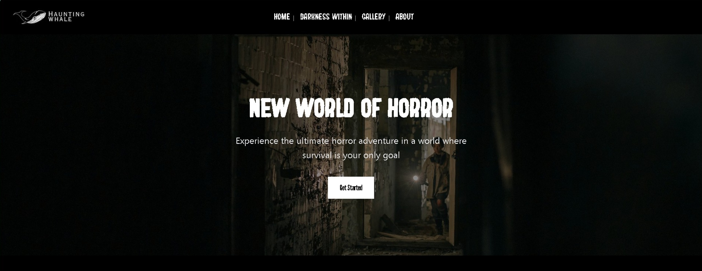

# Indie Horro Game Dev Website 👻

A website showcasing the professional and gamer sides of Mohammed Barakat an aspiring game dev.

## 🚀 Tech Stack
- **Frontend:** React, Next.js and TypeScript.
- **Backend:** Supabase for database and admin authintication, Node.js.
- **Styling:** Tailwind CSS, Shadcn and other custom CSS.
- **Contact:** Resend for the contact form.

## ✨ Features
- Showcasing the gamer and professional sides of Moh via work and clips sections.
- Lists of projects, work and clips.
- Admin page to allow the owner full control and customization of the website.

## 🧑‍💻 Technical
- Connected admin page, homepage and database for unified edits.
- Homepage and a game page to showcase the work of moh.
- A contact form connected to the owners email using Resend.

## 📸 Homepage

## 🎥 Video showcase of the project
[▶️ Watch on YouTube](https://www.youtube.com/shorts/W7AewLJ1PfI)

## 🔗 Check the live website
👉 [Moh's Portfolio](https://mohammed.hiyume.games)